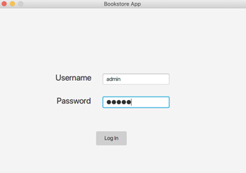
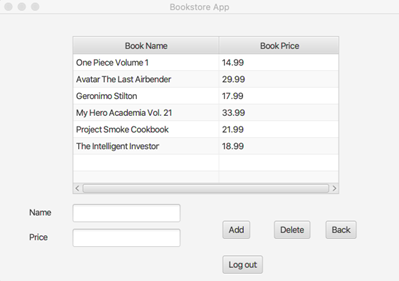
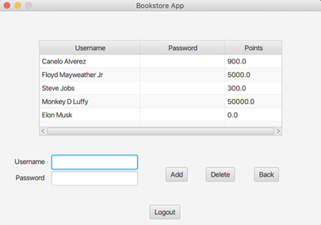
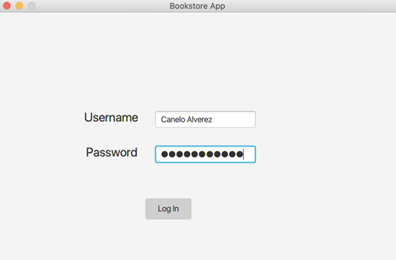
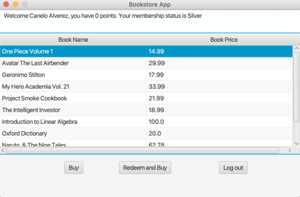

# Bookstore

## Tools Used

- Netbeans IDE for Java development
- Java for handling all the backend logic (data manipulation, updating and retrieving data )
- FXML for the front end (UI)
- Text files for storing data (Owner, Customers, Books)

## Concepts Used

- Object Oriented Programming because everything is an object
- Inheritence for Users, Owners, and Customer. A user of the application is either an Owner or a Customer so Owner and Customer have an inheritence relationship with User
- Encapsulation for accessing data. Only Owner can access Customer and Books data through private methods
- Reading and Writing to files
- Singleton Design Pattern to make sure there can only be 1 Owner
- State Design Pattern to manage different states an object can be in. Book can be in addition or deletion state. Same for Customers.

## Images

